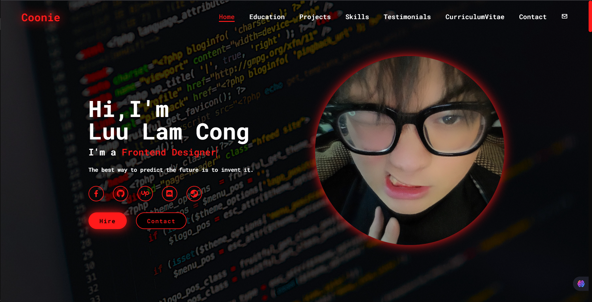

# Personal Portfolio Website



## Giới thiệu

Website "Personal Portfolio" là một ứng dụng web đơn giản nhưng hiện đại được thiết kế để giới thiệu thông tin cá nhân, kỹ năng, kinh nghiệm làm việc và các dự án đã hoàn thành. Website nhằm mục đích làm nổi bật năng lực chuyên môn và phong cách làm việc, tạo ấn tượng mạnh mẽ với các nhà tuyển dụng hoặc khách hàng tiềm năng.

## Tính năng

- 🏠 **Trang chủ**: Giới thiệu tổng quan về bản thân
- 👤 **Thông tin cá nhân**: Chi tiết về học vấn, kinh nghiệm
- 💼 **Dự án**: Showcase các dự án đã thực hiện
- 📞 **Liên hệ**: Form liên hệ và thông tin cá nhân
- 📄 **CV**: Tải xuống CV dạng PDF

## Công nghệ sử dụng

- **Frontend**: HTML5, CSS3, JavaScript
- **Responsive Design**: Tương thích với các thiết bị di động
- **Animations**: Hiệu ứng chuyển động mượt mà
- **Firebase**: Tích hợp Firebase cho các tính năng nâng cao

## Cấu trúc dự án

```text
web-introduce/
├── index.html          # Trang chủ
├── contact.js          # Xử lý form liên hệ
├── function.js         # Các hàm tiện ích
├── css/               # Thư mục chứa file CSS
├── js/                # Thư mục chứa file JavaScript
├── Image/             # Thư mục chứa hình ảnh
├── Icon/              # Thư mục chứa icon
└── CV/                # Thư mục chứa file CV
```

## Hướng dẫn sử dụng

1. Clone repository về máy tính của bạn
2. Mở file `index.html` bằng trình duyệt web
3. Khám phá các tính năng của website

## Demo

Bạn có thể xem demo tại: [Demo Link](https://introduce-myself-phi.vercel.app/)

## Liên hệ

Nếu bạn có bất kỳ câu hỏi nào, vui lòng liên hệ qua email hoặc social media.
